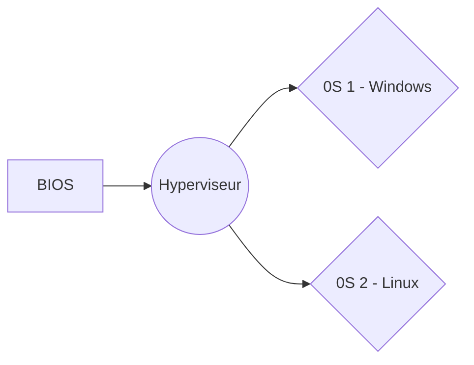
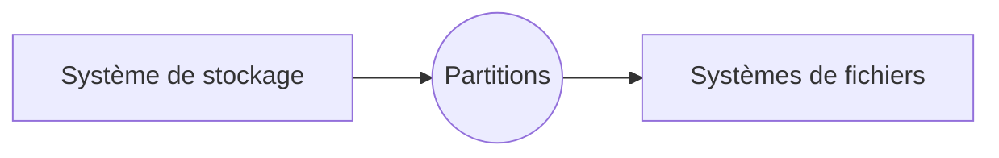

# TP1 - Faire connaissance avec sa machine

Bienvenue à cette première séance de PIT - Passeport Informatique Telecoms. Cette matière a pour objectif de vous faire maitriser de votre poste de travail personnel.

# Table des matières

- [Introduction](#introduction)
  - [BYOD - Bring Your Own Machine](#byod---bring-your-own-machine)
  - [Glossaire](#glossaire)
  - [Objectifs à la fin de la séance](#objectifs-à-la-fin-de-la-séance)
- [Au cœur de votre ordinateur](#au-cœur-de-votre-ordinateur)
  - [Un peu d’histoire](#un-peu-d'histoire)
  - [Processus de boot](#processus-de-boot)
  - [Système d'exploitation](#système-d'exploitation)
- [Introduction à l'administration d'un système d'exploitation](#introduction-à-l'administration-d'un-système-d'exploitation)
  - [Interface IHM](#interface-ihm)
  - [Système de fichiers](#système-de-fichiers)
  - [Editeur de texte](#editeur-de-texte)
  - [Lancer des commandes](#lancer-des-commandes)
- [Fabrication d’une clé USB du département](#fabrication-d'une-clé-usb-du-département)
- [TP 1 - Glossaire](#tp-1---glossaire)
  - [Au cœur d’un ordinateur](#au-cœur-d'un-ordinateur)
  - [Administration d'un système d'exploitation :](#administration-d'un-système-d'exploitation)
  - [Fabrication LiveCD](#fabrication-livecd)

# Introduction

## BYOD - Bring Your Own Machine

La tendance actuelle est à ce que chacun possède une machine personnelle. Durant ces années au sein du département TC, vous serez incités à utiliser votre machine le plus souvent possible.
En cas de difficulté par rapport à votre équipement, n'hésitez-pas à contacter la direction.

### Connexion au Wifi Eduroam

Le premier challenge de ce TP est de s'assurer que vous savez vous connecter au Wifi Eduroam. Pour cela, vous pouvez passer par l'interface graphique de votre OS :

1. Lancez votre connexion Wi-Fi et recherchez 'Eduroam'
2. Lors de la connexion, rentrez :

- Identifiant : pnom@insa-lyon.fr (_p_ pour prénom / _nom_ pour nom)
- Mot de passe : votre mot de passe INSA

> Pourquoi _pnom_ et pas _prenom.nom_ ?

Il n'y a pas vraiment de raison. Il y a de nombreux services sur l'INSA. Certains utilisent prenom.nom@insa-lyon.fr et d'autre pnom@insa-lyon.fr pour s'y connecter. L'INSA travaille à standardiser cela. Pour l'instant, il faut retenir que pour le vpn / wifi, il faut utiliser la version courte du login.

| :triangular_flag_on_post: A VOUS DE JOUER         |
| :------------------------------------------------ |
| Connectez-vous au Wifi Eduroam sur votre machine. |

## Glossaire

Au cours de la séance de PIT, vous rencontrerez des mots et abréviations qui pourrait vous paraître inconnus ..

**Vous aurez un glossaire à rédiger & à rendre lors de l'évaluation.**

Vous devez constituer votre glossaire personnel, avec tous les mots que vous avez appris lors de ces séances.

## Objectifs à la fin de la séance

Voici les quelques objectifs que nous nous fixons pour cette fin de séance :

- vous devez savoir connecter votre machine personnelle au réseau Wifi Eduroam
- vous devrez avoir acquis un certain vocabulaire technique
- vous saurez ce qu'est un interpréteur de commande, et à quoi il sert
- vous aurez tous lancer une commande depuis cette console
- vous aurez fabriquer une clé USB dite "Live CD"

# Au cœur de votre ordinateur

## Un peu d’histoire

Le terme “ordinateur” est apparu en France à la suite d’une conversation entre IBM et un professeur de philosophie. Vous pouvez retrouver cette histoire dans cet [article](https://www.lemonde.fr/blog/binaire/2014/04/01/que-diriez-vous-dordinateur/).

Historiquement l'informatique était perçue comme une boîte-noire distante qui réalisait des calculs pour vous. Pendant de nombreuses années, l'ordinateur n'avait pas de raison d'être au contact de l'utilisateur, et l'informatique était perçue comme une science du raisonnement. La prolifération des machines et son rapprochement de l'utilisateur par l'interface mobile et le web a mis dans la main des utilisateurs ces ordinateurs.

> Vous avez dans votre poche la puissance totale de calcul qui a permis de faire les premiers pas sur la Lune !

Cette démocratisation n'est pas allé de pair avec la maitrise de l'objet technologique. Pour la majorité des individus un smartphone ou un ordinateur de jeu est une boite noire comme une voiture l'est pour son conducteur. En tant qu'étudiant en télécommunications vous allez être au contact de nombreuses boites noires : **toutes ces boites sont fondamentalement des ordinateurs très similaires.** Ce sont des machines d'exécution possédant de la mémoire et des unités de calcul et très souvent gérées par un microprocesseur.

| :triangular_flag_on_post: A VOUS DE JOUER                                                                                                        |
| :----------------------------------------------------------------------------------------------------------------------------------------------- |
| Est-ce que vous pouvez citer des objets informatiques / des boîtes noires dont on se sert mais ne cherches plus à comprendre comment ça marche ? |
| _On peut penser au box Internet (routeurs et/ou switch), aux téléphones, certaines imprimantes, des webcams, voire mêmes des serrures !_         |

> L'objectif de PIT est de vous faire manipuler et comprendre les éléments de votre première boite noire, votre machine personnelle.

## Processus de boot

Vous avez - a priori - tous déjà allumés un ordinateur et attendu devant ces différents écrans qui défilent au démarrage.

> _Savez vous ce qu'il se passe au moment où le bouton "Power" est appuyé ?_

Vous venez - sans a priori en prendre conscience - de mettre plusieurs mécanismes complexes en place pour pouvoir démarrer votre poste.

| :triangular_flag_on_post: A VOUS DE JOUER                                                              |
| :----------------------------------------------------------------------------------------------------- |
| Vous allez trouver ci-dessous plusieurs étapes dans le processus de boot ; remettez les dans l'ordre ! |

- Le BIOS cherche l'information dans quel disque se trouve le _MBR : Mast Boot Record_
- L'OS chosi s'initialise à son tour :
  - création de la mémoire virtuelle
  - initialisation du système de fichier
  - démarrage des processus utilisateurs (login, ...)
- Le BIOS va lire le MBR, qui contient les instructions & informations (partitions) spécifiques pour lancer le _GRUB : Grand Unified Bootloader_.
- Affichage à l'écran des résultats des tests des composants
- Le BIOS charge une série d'instructions de vérifications depuis la _ROM_.
- Appui sur le bouton "Power"
- Le GRUB s'initalise : il charge & exécute le noyau de l'OS selectionné par l'utilisateur.
- Les tests du _POST : Power On Self Test_ sont menés :
  - teste la connectivité de la carte graphique & de l'écran (_affichage d'un logo_)
  - teste la carte son (_beep de démarrage_)
  - teste le CPU (_communication_) & la RAM (_accès aux données_)
- La carte-mère suit les instructions du CPU pour poursuivre le démarrage vers le BIOS.
- Signal envoyé au processeur (_CPU_) qui donne l'instruction d'alimenter la carte mère

## Système d'exploitation

Sur un ordinateur, il y a classiquement entre 2 et 3 systèmes d'exploitations :

- Les systèmes **propriétaires**
- Les systèmes **classiques**
- Les **hyperviseurs**

> _Et le BIOS, il est où dans tout ça ?_

Le BIOS n'est pas tout à fait un système d'exploitation :

- il donne accès au démarrage d'un système
- il liste & contrôle les équipements matériels installés.

**Toutes les machines sont équipées d'un BIOS ou équivalent !** (_Oui également votre téléphone portable, quand vous avez tout perdu, souvent le BIOS va vous sauver)._

### Les systèmes _classiques_

Les systèmes "classiques" sont des systèmes génériques qui s'installent sur plusieurs gammes ou séries de machines.

- **Microsoft** est le pionnier en proposant un système d'exploitation fonctionnant sur toutes les machines à base de puces Intel.

- **Apple** est parti initialement sur un système d'exploitation propriétaire adaptés à sa gamme de machine fonctionnant sur des puces Motorola dans les années 80. Afin de rattraper la concurrence (Microsoft), Apple adoptera un système basé sur Unix BSD dans les années 2000.

- Enfin le dernier système "classique" provient d'une reconcentration de tous les systèmes propriétaires du monde **Unix** (Risc, SGI, HP, SunOS, Solaris...) vers une approche commune unique Linux développé sur processeur Intel.

### Les propriétaires

Certains équipements dédiés à une tâche possèdent des systèmes d'exploitation (OS) propriétaires et spécifique.

- Un **routeur CISCO**, par exemple, repose sur un OS propriétaire similaire à Unix.

- Les téléphones mobiles **iPhone** et les **mobiles non smart-phone**, sont sur des systèmes propriétaires

- C'est aussi le cas de certaines **Box de fournisseurs internet**, etc...

Bien que ces systèmes d'exploitation soient propriétaires, leur structure reste souvent similaire aux systèmes classiques. Bien que la tendance soit à disparaitre, ils restent présents dans des domaines très spécifiques où cet élément est un point crucial concurrentiel.

### Les hyperviseurs

Un système d'exploitation est une abstraction d'organisation de machine permettant d'interagir avec le matériel et le monde extérieur.

> _Peut-on envisager de faire tourner un OS dans un OS ?_

Oui, et c'est tout le principe des **hyperviseurs** !

- Votre OS classique Windows tourne déjà dans un pseudo OS qui est votre BIOS. Un BIOS plus puissant qui pourrait par exemple exécuter simultanément plusieurs systèmes d'exploitation s'appelle un _hyperviseur_.

:warning: Quelque soit l'hyperviseur, il tourne quand même après le BIOS.

- Une machine très puissante moderne (IBM fait ces machines depuis les années 1970) exécute plusieurs systèmes d'exploitation en parallèle. L'empilement des systèmes est donc le suivant :



Cette démarche est importante pour des machines qui ne veulent jamais tomber en panne et ne jamais être redémarrées. En effet, on peut redémarrer l'OS sans redémarrer la machine !

Dans l'immédiat nous laissons de côté les hyperviseurs, même si vous allez rapidement :

- soit lancer un OS dans un autre OS (_Windows WSL_
- soit accéder à un hyperviseur (_Bureau virtuel INSA_).

Recentrons-nous sur les OS plus classiques.

### Rôle d'un système d'exploitation

**C’est le système de pilotage de l’ordinateur, qui gère les différents composants.**

| :triangular_flag_on_post: A VOUS DE JOUER                 |
| :-------------------------------------------------------- |
| Avec l'enseignant, ouvrez & explorer une machine physique |

Pour comprendre, revenons sur le rôle d'un ordinateur : il doit éxecuter des processus.

> _Déjà, qu'est-ce qu'un processus ?_

Un processus est un enchaînement de fonctions qui s'appellent entres elles. Par conséquent, un processus possède toujours une fonction d'entrée.

> _Et du coup c'est quoi une fonction ?_

C'est l'exécution d'une tâche précise. Une fonction a besoin :

- de mémoire pour stocker ses variables temporaires
- de pouvoir accéder à des zones mémoires spécifiques pour dialoguer avec des équipements physiques connectés
- de pouvoir être mise en attente d'un évenement particulier

**Toutes ces activités sont réglementées par le systèmes d'exploitation !**

Pour un seul processus :

- Définition de la fonction de démarrage d'un programme
- Réservation de la mémoire nécessaire pour l'exécution des fonctions
- Cartographie d'une autre partie de la mémoire pour permettre l'accès aux équipements physique (clavier, souris, carte réseau...)

Pour l'ensemble des processus :

- Autoriser un nouveau processus a être lancé
- Choisir les processus à faire avancer dans leur exécution
- Faire croire à un processus qu'il est seul à utiliser la machine
- Mettre en pause un processus qui n'a rien à faire ou qui doit laisser la place aux autres
- Mettre en pause un processus en attendant un événement particulier (arrivée d'un signal sur le réseau)
- Tuer un processus qui a un comportement étrange

> _Moi j'ai déjà utilisé Windows et tout ça c'est assez transparent pour moi à vrai dire ..._

Et c'est tout l'intérêt d'un OS : il offre une interface d'interaction.

> :information_source: Seule la mémoire 'vive' de l'ordinateur est gérée par le système d'exploitation : c'est la seule qui soit visible par le microprocesseur.
>
> L'accès est cependant très complexe pour des questions de caches et de vitesse d'accès.

Les détails de fonctionnement d'un OS seront vu en cours de **PPC** plus tard dans l'année, mais n'hésitez-pas à remonter vos questions si vous en avez.

Si jamais vous souhaitez poussés ces concepts dès à présent, vous pouvez retrouver un analogie pertinente entre le monde du pain et un système d’exploitation [ici](./DETAILS/boulangerie_OS.md) :

Vous pouvez aussi retrouver ces différents concepts expliqués :

- Dans cet article du monde : ["Podcast : Système d’exploitation"](https://www.lemonde.fr/blog/binaire/2017/06/14/podcast-systeme-dexploitation/)
- Dans cette vidéo : ["Le système d'exploitation en trois idées clés"](https://www.youtube.com/watch?v=SpCP2oaCx8A)

### La diversité d'OS

Le système d'exploitation est donc une pièce maîtresse d'une machine : c'est lui qui règlemente l'accès des processus actifs à la machine.

> _Pourquoi existe-t-il plusieurs OS s'ils font tous la même chose ?_

Parce q'uil existe des milliers de techniques différentes pour réglementer ces accès, il existe autant de systèmes d'exploitation différents. Chaque OS ayant une philosophie d'organisation différente :

- Unix / Linux essaye de représenter toute son activité sous la forme de fichiers. Chaque entité présentée gérée par l'OS possède une seconde représentation sous la forme d'un fichier.
  - Le fichier _/dev/ttys0_ représente une interface de liaison série de la machine.
  - Le repertoire _/proc_ contient une représentation de l'ensemble des processus en action sur l'OS.
- Sur windows, depuis la version NT, l'ensemble des informations du système d'exploitation est partagée dans la base de registre. C'est une base de données où on peut retrouver toutes les informations d'organisation de l'OS.
  - Pour visualiser le registre sur votre machine Windows, vous pouvez réaliser la combinaison `Windows + R` puis taper `regedit`.

Vous pouvez une liste (non-exhaustive) de ces OS ici : [Wikipédia - Liste OS](https://fr.wikipedia.org/wiki/Liste_des_syst%C3%A8mes_d'exploitation)

# Introduction à l'administration d'un système d'exploitation

## Interface IHM

### Console & Terminal

L’interface Homme-Machine est ce qui nous permet d’utiliser si bien les ordinateurs. Les IHM les plus basiques - celles qui sont apparues en premier - sont ce qu’on appelle des “interpreteurs de commande”, qu’on peut aussi appeler [console](https://doc.ubuntu-fr.org/console).

Il est nécessaire de savoir s’en sortir avec une console, car de nombreuses opérations ne peuvent être effectués que sous console (Pas d'écran graphique disponible : équipement embarqué, ou équipement austère de terrain, pas de puissance à perdre avec une autre interface...)

- toutes les tâches d’administration système (gestion d’utilisateurs, autorisations, …)
- certains systèmes d’exploitation tournent uniquement sous ligne de commande
- déploiement / gestion d’un serveur distant : les interfaces graphiques sont très pratiques si un utilisateur utilise fréquemment le poste, mais beaucoup moins si on doit uniquement faire tourner sur une machine d'un site distant
- compilation et débogage de programme
- automatisation de tâches (scripts)

Sous vos machines graphiques, vous avez accès à un [émulateur de terminal](https://doc.ubuntu-fr.org/terminal) : c’est un programme qui émule une console dans un interface graphique.

| :triangular_flag_on_post: A VOUS DE JOUER                         |
| :---------------------------------------------------------------- |
| Trouvez comment lancer un terminal de commande sur votre machine. |

### Interpréteur de commande

> Concrètement, que se passe-t-il quand une commande est écrite ?

Lorsqu’une commande est entrée, elle est passé à l’interpréteur de commande (_shell_, _bash_, _sh_, _powershell_, _batch_...). Celui-ci retrouve le script associé à la commande et exécute les instructions ligne à ligne : il **interprète** ligne à ligne.

De nombreux interpréteurs de commandes existent :

- Bash (_Bourne-Again shell_) : shell associé par défaut sur Ubuntu.
- Command shell (_cmd_) : shell utilisé par l’invite de commande Windows.
- _Powershell_ : toujours sous Windows, il remplace petit à petit l’invite de commande Windows. Il intègre des commandes similaires à UNIX, même si des différences subsitent.

Pour configurer votre terminal sous votre OS préféré, vous pouvez vous référer à cette [page de l’astus](https://tcastus.github.io/TChelp/Travailler_a_distance/1-Terminal.html).

## Système de fichiers

Le terme [système de fichiers](https://fr.wikipedia.org/wiki/Syst%C3%A8me_de_fichiers) désigne :

- l'organisation des informations mémorisées sur les périphériques de stockage de l'ordinateur (formatage de l'organisation)
- la vue logique hiérarchique présentée à l'utilisateur.

Les informations sont stockées dans des paquets appelées **_fichiers_**, écrits dans un certain **_format_**, c'est-à-dire selon une certaine manière d'encoder les informations en binaire. Ces fichiers peuvent être aussi bien du texte, une page web, un morceau de musique, une photo de vacances, un script, un logiciel, etc.

Un **_répertoire_** regroupe des fichiers ou d'autres répertoires, ce qui aboutit à une hiérarchie de fichiers. C'est le [chemin d'accès](<https://en.wikipedia.org/wiki/Path_(computing)>) qui permet de localiser un fichier de la hiérarchie.

#### Naissance du système de fichiers

Avant les années 80, on stockait les informations sur des bandes magnétiques ! Mais une révolution a permis un réel stockage de l'informatin : le disque dur (le "D" de DOS). Il permet de stocker de l'information dans une unité qui s'appelle le fichier.

> La question se pose alors : comment faire un système de fichiers ?

| :triangular_flag_on_post: A VOUS DE JOUER                                                                                                                                              |
| :------------------------------------------------------------------------------------------------------------------------------------------------------------------------------------- |
| Lorsqu'est venu la problématique de réaliser des systèmes de stockage, deux solutions sont apparus : le stockage "à plat" et le stockage "avec hierarchie". Dessinez ces deux modèles. |

<details>
<summary> <b>Les différentes solutions de stockages </b> </summary>

- _1ère solution_ : stocké les fichiers **à plat** :
  - tous les fichiers sont dans un lieu unique ; on les distinguent alors par leur nom.

<pre>
.
└── D
├── fichier1.txt
├── fichier2.txt
├── fichierA.txt
├── fichierB.txt
└── fichierRouge.txt
</pre>

- _2ème solution_ : organiser ces fichiers dans une **hiérarchie de stockage**. La hiérarchie permet :
  - de regrouper des fichiers ayant des raisons similaires (tous les périphériques matériels sous unix sont regroupés dans le repertoire _/dev_)
  - de réduire le nombre de fichiers stockés dans un même répertoire.

<pre>
.
└── D
├── repertoireChiffre
│ ├── fichier1.txt
│ └── fichier2.txt
├── repertoireLettre
│ ├── fichierA.txt
│ └── fichierB.txt
└── repertoireCouleur
└── fichierRouge.txt
</pre>

</details>

#### Caractéristiques d'un système de fichiers

| :triangular_flag_on_post: A VOUS DE JOUER                                                                       |
| :-------------------------------------------------------------------------------------------------------------- |
| Retrouver les divers caractères qui caractérisent un système de fichiers, et remplissez le tableau ci-dessous : |

|                             | Linux                                                                                                                                        | Windows                                       | Description                                                                                |
| --------------------------- | -------------------------------------------------------------------------------------------------------------------------------------------- | --------------------------------------------- | ------------------------------------------------------------------------------------------ |
| **Des racines**             | ?                                                                                                                                            | ?                                             | Une hierarchie démarre par une ou plusieurs racines d'organisation.                        |
| **Séparateur de structure** | ?                                                                                                                                            | ?                                             | Sépare les répertoires et fichiers dans les chemins d'accès.                               |
| **Commande de navigation**  | ?                                                                                                                                            | ?                                             | Permet de naviguer dans la structure de fichiers.                                          |
| **Le chemin**               | _Exemple : /home/utilisateur/dossier/fichier_                                                                                                | _Exemple : C:\user\dossier\fichier_           | ?                                                                                          |
| **Chemin complet / absolu** | Commence par ...                                                                                                                             | Commence par ...                              | Décrit le parcours de la hiérarchie de fichiers de manière ininterrompue depuis la racine. |
| **Chemin relatif**          | Je suis actuellement dans le répertoire au chemin complet `/home/user/dossier`, et je souhaite revenir au répertoire `user`. Comment faire ? | Même question mais avec des commandes Windows | Décrit le parcours de la hiérarchie depuis le répertoire courant.                          |

| :triangular_flag_on_post: A VOUS DE JOUER                                     |
| :---------------------------------------------------------------------------- |
| Pour voir si vous avez bien compris, répondez aux deux questions ci-dessous : |

> _Que fait la commande suivante : `cd ../../opt/toto/../toto` ?_

> _Quelle est la différence entre `./toto.sh` et `toto.sh` ?_

| :triangular_flag_on_post: A VOUS DE JOUER                                                                                        |
| :------------------------------------------------------------------------------------------------------------------------------- |
| Entraînez-vous à naviguer grâce [Find your path](http://demo710.univ-lyon1.fr/FYP/). Puis, mettez en pratique sur votre machine. |

#### Les partitions

Lorsque le système d'exploitation s'installe, il prépare le disque dur et y installe des systèmes de fichiers (ou plus souvent plusieurs) :

- Sous Unix la commande `fdisk`, indique tous les systèmes de fichiers d'un périphérique de stockage.
- Dans windows la commande `diskmgmt` permet d'accéder à la structuration des disques.

| :triangular_flag_on_post: A VOUS DE JOUER                                                          |
| :------------------------------------------------------------------------------------------------- |
| Retrouver sur votre machine les différentes partitions qui existent, et posez vous ces questions : |

- Qu'est ce que c'est _FAT 32_ & _NTFS_ ?
- Qu'est-ce qu'une partition EFI ? Une partition de récupération ?
- Est-ce qu'un de mes disques est saturé ?

Un disque dur ne peut être partitionné qu'en 4 partition primaires, si le système en désire plus, il peut marquer une des partition primaire comme partition étendue. Il est alors possible de créer des sous-partitions dans cette partition étendue (ici encore un principe de hierarchie).

> :warning: Manipuler les partitions peut être dangereux car votre système d'exploitation et par exemple les octets de démarrage sont inscrits dessus. Le BIOS va les rechercher pour démarrer le système.

La hiérarchie matérielle vers logicielle est la suivante :



- Le système de stockage est souvent un disque dur, mais peut aussi être une clé USB, un DVD, ..
- chaque système de stockage est décomposé en 1 ou plusieurs partitions
- chaque partition héberge un système de fichier spécifique

> Le détail de fonctionnement de tous les systèmes de fichiers sort du cadre de PIT, mais la majorité est **hiérarchique** et permet de définir des répertoires et des fichiers dans ces répertoires.

#### Partition de SWAP

> _Si mon disque est saturé, est-ce que mon PC ne va plus du tout fonctionner ?_

Le [système de fichiers de SWAP](https://fr.wikipedia.org/wiki/Espace_d%27%C3%A9change) permet d'étendre la mémoire physique sur une partition du disque dur. Cela permet :

- de faire croire à certaines applications qu'il y a plus de mémoire disponible que réellement
- à des application de survivre alors qu'il n'y a plus de mémoire disponible sans les arrêter brutalement.

:rotating_light: Le swap est un mécanisme d'urgence pour éviter le crash d'une machine, mais l'accès disque étant très lent. Lorsqu'une machine swappe, c'est un signe qu'elle est à arrivée à saturation des processus actifs.

### Répertoires de l'OS

> _A quoi correspondent les répertoires ?_

Il n'y a pas d'obligation dans l'organisation des repertoires ni sous Unix, ni sous Windows. L'organisation est une pure convention historique et bien souvent elle n'est pas toujours respectée.

Par convention on distingue :

- les répertoires et fichiers apportés par le systèmes d'exploitation
- les repertoires et fichiers apportés par les applications supplémentaires installées
- les répertoires et fichiers des utilisateurs

| :triangular_flag_on_post: A VOUS DE JOUER                              |
| :--------------------------------------------------------------------- |
| Trouver les 3 différents répertoires cités ci-dessus sur votre machine |

<details>
<summary> <b>Les répertoires : en pratique </b> </summary>

- Sous UNIX (Linux & Mac), beaucoup de répertoires sont liés au système :

  - _/dev_ : contient des fichiers représentant tous les périphériques matériels de l'ordinateur
  - _/etc_ : contient tous les fichiers de configuration et de démarrage
  - _/var_ : contient les éléments variables de supervision de la machine : trace, log, etc...
  - _/usr_ : contient les logiciels du systèmes d'exploitation
  - _/tmp_ : contient des fichiers temporaires
  - _/proc_ : contient des fichiers qui représentent l'exécution en cours du système

- Sous Windows :
  - _C:\Program Files_ : les repertoires & fichiers apportés par les applications supplémentaires installées
  - _C:\Users\nom-utilisateur_ : les répertoires et fichiers des utilisateurs
  - _C:\Windows_ : répertoires & fichiers apportés par le systèmes d'exploitation
  - _C:\Windows\Temp_ : contient les fichiers temporaires

</details>

### Fichiers de l'OS

#### Fichier d'utilisateurs

Unix et Windows sont des systèmes d'exploitation **multi-utilisateurs**. Cela veut dire :

- qu'il peut y avoir plusieurs profils et droits utilisateurs sur une même machine
- que plusieurs utilisateurs peuvent exécuter des processus simultanément.

La distincion est importante car on doit distinguer un système qui possède des _espaces_ de stockage pour chaque utilisateur, mais n'autorisant qu'un seul utilisateur connecté à la fois.

- Typiquement, Windows et MacOS dans leur usage de base où il faut changer de session pour autoriser un autre utilisateur et donc mettre en pause son activité.
  - On retrouvera les repertoires _/Users_ ou _/Utilisateurs_ pour Windows ou Mac.
- Unix est historiquement fait pour héberger plusieurs sessions utilisateurs qui se déroulent en même temps, par des accès distants simultanés (car il n'y a qu'un seul écran et un seul clavier connecté à un ordinateur).
  - On retrouvera les répertoires _/home_ pour les utilisateurs Unix

#### Droits sur les fichiers

Les fichiers (et les répertoires) possèdent des droits. Les droits autorisent (ou non) un utilisateur X d'utiliser un fichier appartenant à un utilisateur Y.

Les droits classiques et communs sont liés :

- soit à l'utilisateur
- soit au groupe d'utilisateur

Il y a trois types de droits :

- lecture
- écriture
- exécution.

> **_NB :_** Cela diffère un peu entre Windows et Unix, mais reste très similaire dans l'idée générale.

| :triangular_flag_on_post: A VOUS DE JOUER                                   |
| :-------------------------------------------------------------------------- |
| Choissiez un fichier de votre machine & déterminer quels droits il possède. |

- Sous Windows, vous pouvez utiliser la commande `icalcs`. A quoi correspondent les lettres entre parenthèses ?
  - F = Full Control, R = Read, W = Write, X = Execute
- Sous linux, la commande `ls -l` suffit. Comment retrouve-t-on les permissions :
  - _Exemple :_ `-rw-r--r-- 1 utilisateur groupe 1024 juil. 24 10:00 fichier.txt`
    - Les trois groupes de trois caractères suivants (`rw-`, `r--` et `r--` dans cet exemple) représentent respectivement les permissions du propriétaire, du groupe et des autres utilisateurs.
    - Chaque groupe de trois caractères indique les droits de lecture (`r`), d'écriture (`w`) et d'exécution (`x`). Un tiret (`-`) indique que cette permission est absente.

#### Fichiers et répertoire d'application externes

On parle ici des applications externes que vous installer classiquement sur vos ordinateurs :

- Sous windows, ils sont installés où l'utilisateur le souhaite
  - Couramment, c'est dans `C:\Program Files`
- Sous Linux, `/usr/local` et `/opt` sont classiquement utilisé à cet usage (mais les programmes peuvent être installés n'importe où en pratique).

#### Différences entre fichiers

Les différences sont mineurs mais systèmatiques. Vous trouverez [ici](./files) quatre fichiers contant la chaine "Bonjour Stéphane".

| :triangular_flag_on_post: A VOUS DE JOUER                                                                                    |
| :--------------------------------------------------------------------------------------------------------------------------- |
| Ces 4 fichiers ont l'air similaires mais sont en réalité différent ... trouver un moyen de le voir puis de les caractériser. |

<details>
<summary> <b> Quelques commandes utiles pour l'encodage de fichier : </b> </summary>

- Powershell :

  - `Get-Content`
  - `Format-Hex`

- Cmd (Windows):

  - `type`

- Linux :
  - https://doc.ubuntu-fr.org/tutoriel/encodage_caracteres
  - `file -i`
  - `hexdump`
  - `iconv`

</details>

### Environnement utilisateur

Lorsque qu'un utilisateur se connecte sur une machine le système lui associe un _environnement_. L'environnement définit trois choses :

- son shell d'interaction
- son répertoire personnel (souvent dénommé _home_)
- des variables dites d'environnement.

A l'ouverture d'une interface de commande, le système charge l'environnement en fonction du shell utilisé (sous Linux, c'est en se plaçant dans `cd /home/user`, `user` étant le répertoire de l'utilisateur )

#### Variables d'environnement

Chaque environnement possède donc des variables ; certaines sont communes entre tous les environnements, d'autres sont propres à chaque environnement.

Pour connaitre l'ensemble des variables définies de son environnement, on retrouve la commande :

- Sous Linux : `env`
- Sous Powershell : `gci env:`
- Sous cmd : `set`

| :triangular_flag_on_post: A VOUS DE JOUER                                                                                                                           |
| :------------------------------------------------------------------------------------------------------------------------------------------------------------------ |
| Comparer les variables de votre environnement et de celui de vos voisins ; quelles variables sont communes & quelles variables sont propres à votre environnement ? |

Certaines de ces variables intéressent directement le système d'exploitation. Par exemple la variable `$PATH` sur Unix ou `%PATH%` sous Windows indique où rechercher un fichier à exécuter.

> Vous vous souvenez de `./toto.sh` et `toto.sh` ?

- avec `./toto.sh`, on indique à l'OS où trouver le programme `toto`
- avec `toto.sh`, on demande à l'OS de trouver le programme `toto`
  - les fichiers sources de ce programme seront recherchés dans les répertoires indiqués dans `$PATH` (ou `%PATH%`).

| :triangular_flag_on_post: A VOUS DE JOUER                                                                      |
| :------------------------------------------------------------------------------------------------------------- |
| Choisissez un programme installé sur votre machine, et trouver son répertoire indiqué dans la variable `PATH`. |

Sous UNIX :

- `PATH = "/usr:/opt:/usr/local"` : le fichier sera recherché de manière séquentielle (un après l'autre) dans `/usr` puis dans `/opt`, puis dans `/usr/local`
  - Notez que la recherche ne parcours pas la hiérarchie. `PATH=".:/tmp"` recherchera dans le repertoire courant (celui où vous lancez la commande) puis dans `/tmp`.

Sous Windows :

- La variable sera `PATH="/usr;/Temp;."`.

> _Ok, je sais comment accéder à mes variables d'environnement ... maintenant soyons fous, je veux en rajouter une._

Voici comment déclarer des variables d'environnement :

- Sous cmd (windows) : `set` - (`set MY_VARIABLE="Hello World"`)
- Sous Powershell: `$env:` - (`$env:MY_VARIABLE = "Hello World"`)
- Sous Linux : `export` - (`export MY_VARIABLE="Hello World"`)

Voyez les exemples ci-dessous

```bash
# Linux
$ export PATH=$PATH:/toto:/tmp
$ echo $PATH # Affichage de la variable PATH

# Windows cmd
$ set PATH=%PATH%;\toto;\tmp
$ echo %PATH% # Affichage de la variable PATH

# Powershell
$ $PATH = [Environment]::GetEnvironmentVariable("PATH")
$ $xampp_path = "C:\xampp\php"
$ [Environment]::SetEnvironmentVariable("PATH", "$PATH;$xampp_path")
$ echo $env:path # Affichage de la variable PATH
```

Dans notre exemple, nous définissons la variable `PATH` à partir de sa valeur courante `$PATH`, mais ce n'est qu'un exemple.

| :triangular_flag_on_post: A VOUS DE JOUER                             |
| :-------------------------------------------------------------------- |
| Ajouter une variable d'environnement, consulter la puis supprimer la. |

#### Jeux de caractères

Vous commencerez à noter l'apparition fréquente de certains caractères. Entre les environnements, certains se ressemblent mais sont tout de même différent :

| Utilisation                          | Linux    | CMD (Windows) | PowerShell                                                                                   |
| ------------------------------------ | -------- | ------------- | -------------------------------------------------------------------------------------------- |
| Système de fichiers                  | `/`      | `\`           | \                                                                                            |
| Déclaration de variables             | `$`      | `%..%`        | `$`                                                                                          |
| Déclaration du chemin de la variable | `:`      | `;`           | `::` & `,` & `;`                                                                             |
| Exportation de variable              | `export` | `set`         | `$env:MY_VARIABLE = "Hello World"` ou `[Environment]::SetEnvironmentVariable("PATH", <xxx>)` |
| Suppression de variable              | `unset`  | `set`         | `Remove-Item -Path`                                                                          |

Chaque `shell` d'exécution utilise son propre fichier de configuration :

- si vous utilisez `bash`, un fichier `.bashrc` existe à la racine de votre environnement (ou vous pouvez en créer un nouveau).
  - Il permet de définir des variables de manière systèmatique à chaque connexion utilisateur.
  - Il y a d'autres fichiers de configuration mais ils sont fortement liés entre eux.
- si vous utilisez `zsh`, un fichier `.zshrc` existe à la racine de votre Home.
- sous Windows, vous pouvez utiliser des commandes comme `setx`, qui positionneront dans la registry votre environnement ou vous pouvez éditer directement la registry.

> _Remarques complémentaires sur le choix des OS ..._

Il n'existe pas de différences fondamentales dans les systèmes d'exploitation dits _classiques_. Les différences résident dans la simplicité ou la complexité de certaines interactions avec l'OS.

Par exemple, si vous interagissez majoritairement en shell, vous constaterez qu'il est préférable d'écrire `export PATH` que `[Environment]::SetEnvironmentVariable("PATH", <xxx>)` ... mais le résultat est équivalent !

> **In fine, c'est à l'utilisateur de décider et d'apprendre son système quel qu'il soit.** En maitrisant correctement un seul de ces environnement, vous arriverez nécessairement à vos fins !

## Editeur de texte

Afin de pouvoir éditer des fichiers de type texte, il vous faut obligatoirement maîtriser un (ou plusieurs) [éditeurs de texte](https://fr.wikipedia.org/wiki/%C3%89diteur_de_texte). Voici quelques noms les plus courants :

- **Notepad ++** : historiquement sous la distribution Windows
- **Vi** (ou **Vim**) : historiquement sous la distribution Linux
- **TextEdit** : historiquement sous la distribution iOS
- **Visual Studio Code**

> _Mais pourquoi existent-ils plusieurs éditeurs de texte ? Ils font pas tous la même chose ?_

Les éditeurs de textes modernes peuvent se comparer, mais certaines fonctionnalités sont nécessairement pour améliorer la lisibilité, et donc réduire les erreurs. La plus essentielle est la [coloration syntaxique](https://fr.wikipedia.org/wiki/Coloration_syntaxique) : cela consiste à formater automatiquement chaque éléments affiché en utilisant une couleur / fonte caractéristique.


D'autres fonctionnalités peuvent rapidement faire gagner en productivité, comme :

- gestion des abréviations
- indentation automatique
- interaction avec des programmes externes (comme des compilateurs).

Intéressons nous de plus prêt à ces fameuses commandes.

## Lancer des commandes

### Types de commandes

On peut classer en 4 grandes familles les instructions que l'on peut envoyer à l'ordinateur via le système d'exploitation.

- Manipulations des processus (lancement, `kill`...)
- Manipulations du système de fichiers (`cd`, `ls`...)
- Manipulations des variables d'environnement (`export`, `alias`...)
- Manipulations algorithmiques pour enchainer les manipulation précédentes (`if`, `for`...)

Pour être maître de sa machine, il est nécessaire de maitriser les principes de ces 4 familles d'instructions.

### Votre première commande

Ouvrez l'interpréteur de commande de votre choix, et entrer la commande suivante :

`$ echo -n "Hello world !"; ls`

Décomposons chacun des caractères :

- `$` : on l'apelle le _prompt_ et signale le début d'une commande. Toujours suivi d'un espace pour le séparer de la commande
- `echo` : C'est une _commande_ qui permet d'afficher du texte sur la console.
- `-n` : Le symbole - symbolise une _option_ / un paramètre de la commande précédente. Dans ce cas précis, c'est une option de la commande echo, qui permet de ne pas avoir de retour à la ligne après l'affichage du texte.
- `"Hello world !"` : c'est le texte à afficher via la commande echo.
- `;` : c'est le _séparateur de commande_ ; il permet de lancer une autre commande sur la même ligne de l'interpréteur.
- `ls` : c'est une seconde commande (de manipulation de fichiers).

| :triangular_flag_on_post: A VOUS DE JOUER                                                                                               |
| :-------------------------------------------------------------------------------------------------------------------------------------- |
| Lancer votre première commande ! Amusez-vous avec les possibilités de la commande `echo`, et essayer d'écrire sur 3 lignes différentes. |

### Les entrées sorties

Chaque processus lancé (_ex: une commande_) accède à trois éléments fournis par l'OS :


- **l'entrée standard (stdin)** :

  - C'est un flux de données qui permet à un programme de recevoir des données en entrée
  - Cela est couramment une entrée texte, mais
  - Le programme peut lire ces données depuis l'entrée standard pour les utiliser dans son exécution.
  - _Exemple_ : En tapant `cat` sans argument, affiche dans la sortie standard la ligne précédemment tapée. Une suite de caractères devient une ligne lorsque l'on tape sur la touche entrée. Un caractère '\n' est alors ajouté en fin de ligne. (Sous windows, deux caractères sont ajoutés \Od\Oa ou )

  ```
  debian@linux:/$ cat
          // attente d'entrée de texte qui sera répété par la suite
  zorglub // entré par l'utilisateur
  zorglub // répété par le programme
  ```

  L'entrée standard est rarement utilisé

- **la sortie standard (stdout)** :
  - C'est l'affichage du résultat de l'exécution de la commande.
  - Souvent affiché directement dans la fenêtre où la commande a été lancée
  - _Exemple_ : `$ ls` affiche dans la sortie standard la liste des fichiers du répertoire courant.
  ```
  debian@linux:/$ ls
  bin  boot  dev  etc  home  ...
  ```
- **la sortie d'erreurs (stderr)** :
  - C'est l'affichage des erreurs d'exécution d'un processus.
  - Par défaut, elle est souvent dirigé vers la fenêtre où la commande a été lancée
  - _Exemple_ : `$  echo -n "Hello world !"; zorglub` est composé d'une commande valide & d'une commande invalide. La première commande va s'exécuter sans problème, mais la seconde est inconnue. Un message d'erreur va donc être redigiré vers la console.
  ```
  debian@linux:/$  echo -n "Hello world !"; zorglub
  Hello world !zorglub: command not found
  ```

#### Redirection de flux

La grande force de l'OS, c'est de pouvoir **détourner et enchainer les entrée / sorties de commandes.**

| Opérateur | Description                                       | Exemple (Linux)                                  |
| --------- | ------------------------------------------------- | ------------------------------------------------ |
| `<`       | Redirige l'entrée standard depuis un fichier      | `cat < toto.txt` est différent de `cat toto.txt` |
| `>`       | Redirige la sortie vers un nouveau fichier        | `ls > file_list.txt`                             |
| `>>`      | Ajoute la sortie à la fin d'un fichier existant   | `ps aux >> process_list.txt`                     |
| `2>`      | Redirige les erreurs vers un fichier              | `commande_inexistante 2> error_log.txt`          |
| `2>&1`    | Redirige les erreurs vers le flux de sortie       | `ls /dossier_inexistant 2>&1`                    |
| `&>`      | Redirige la sortie et les erreurs vers un fichier | `commande_inexistante &> output_errors.txt`      |

L'opérateur ultime des OS : le `|`, _pipe_ (ou tube en français). L'opérateur permet de rediriger le résultat d'une commande (sa sortie standard) vers l'entrée d'une autre commande. Cela crée un tube de données circulant entre la sortie de la commande de gauche vers l'entrée de la commande de droite.

| Opérateur | Description                                         | Exemple (Linux)                   |
| --------- | --------------------------------------------------- | --------------------------------- |
| `\|`      | Passe la sortie d'une commande à une autre commande | `cat fichier.txt \| grep "motif"` |

| :triangular_flag_on_post: A VOUS DE JOUER                                 |
| :------------------------------------------------------------------------ |
| Voici quelques petits exercices sur la redirection de commandes & de flux |

1. Sachant que la commande `wc` compte les mots dans une ligne et que la commande `ls` affiche la liste des fichiers et repertoire dans une ligne, que fait la commande suivante `ls | wc` ?

2. Que fait la commande `find` ?

   - utilisée pour rechercher des fichiers et des répertoires dans une arborescence de répertoires
   - syntaxe : `find chemin -options critères`

3. Que fait la commande `xargs` ?

   - utilisée pour convertir une entrée standard en arguments de commande
   - permet d'éviter les limitations de longueur de ligne de commande.
   - syntaxe : `commande_source | xargs commande_cible`

4. Que fait la commande `file` ?

   - utilisée pour déterminer le type de fichier en se basant sur son contenu.
   - syntaxe : `file chemin_vers_fichier`

5. Que fait la commande `sort` ?

   - utilisée pour trier les lignes d'un fichier texte ou les lignes d'une entrée donnée
   - syntaxe : `sort [options] [fichier]`

6. Listez les fichiers du répertoire courant dans l'ordre alphabétique inverse.

7. Faites un schéma de comment les instructions communique entre elles (entrées / sorties)

8. Re-exécuter cette commande en dirigeant tout son flux de sortie vers un fichier `log.txt`

   - `command > test1.txt`

9. Exécuter les commandes `echo "Bonjour"; zorglub`, rediriger sa sortie standard vers un fichier `sortie.txt` et sa sortie d'erreur dans un fichier `erreur.txt`
   - `(echo "Bonjour"; zorglub) > sortie.txt 2> erreur.txt`
     - :warning: il faut bien penser aux parenthèses pour avoir le flux qui se redirige pour les deux commandes

### S'en sortir avec de nouvelles commandes

Des commandes, ils en existent des centaines de différentes. Vous ne les maitriser peut-être pas toutes directement, mais vous devez savoir chercher l'information pour ne pas être bloqué.

Nous allons voir maintenant télécharger un fichier depuis un serveur distant. Pour cela, plusieurs commandes existent mais nous allons nous concentrer sur la commande _curl_, puisqu'elle est quasi-similaire sous bash & sous l'invite de commande Windows.

> _Mais je ne connais rien à la commande curl ! Comment savoir ce qu'elle fait, et comment l'utiliser ?_

Pour cela, plein de ressources existent :

- **chercher l'information sur Internet** :
  - https://ss64.com/ : un site qui condense les informations utiles selon les différents environnements
    - _Exemple curl cmd :_ https://ss64.com/nt/curl.html
    - _Exemple curl bash :_ https://ss64.com/bash/curl.html
  - https://explainshell.com/ : un site qui vous permet de détailler une commande
    - _Exemple détails curl:_ https://explainshell.com/explain?cmd=curl+-o+test.txt+example.com%2Ffile.txt
- **utiliser la documentation interne à l'interpréteur de commande** :
  - sous les environnements UNIX, vous pouvez taper `man cmd` pour avoir une information sur votre commande `cmd`
  - sous Windows, vous pouvez tenter `help cmd` ou bien `cmd --help` ; cela diffère selon les commandes.

Si vous êtes familier à un environnement particulier et que vous souhaitez connaître l'équivalent sur un autre environnement, voici quelques ressources :

- **sous Powershell** : vous pouvez utiliser la commande `Get-Alias`
  - _Exemple :_
  ```
  >$ Get-Alias curl
  CommandType     Name
  Alias           curl -> Invoke-WebRequest
  ```
- **Tableau des équivalents** : vous retrouverez ici un tableau qui regroupe quelques commandes utiles et leurs équivalents : [Tableau des équivalents](https://docs.google.com/spreadsheets/d/1FKgaDDRFXUb8ByyLyGI6uXBWdHEfiZuKsXSLv83PuQ4/edit?usp=sharing)

| :triangular_flag_on_post: A VOUS DE JOUER                                                                                                                                                                                                         |
| :------------------------------------------------------------------------------------------------------------------------------------------------------------------------------------------------------------------------------------------------ |
| Revenons à notre téléchargement : essayer de télécharger puis d'enregistrer cette [image](https://upload.wikimedia.org/wikipedia/commons/thumb/b/b9/Logo_INSA_Lyon_%282014%29.svg/2560px-Logo_INSA_Lyon_%282014%29.svg.png) sur votre ordinateur. |

Vous venez de voir l'intérêt des options : `curl` sans options télécharge bien l'image mais ne l'enregistre pas ! Très souvent, les options sont nécessaires dans les commandes.

# Fabrication d’une clé USB du département

Vous allez maintenant fabriquer une clé USB qui va servir de LiveCD.

> _Une clé USB, un live CD ... je commence à être perdu._

Rendez-vous sur cette page de l'[astus](https://tcastus.github.io/TChelp/Ressources/LiveCD/LiveCD-Details.html).

Une fois compris ce qu'est le principe d'un LiveCD, passons à la réalisation grâce à cette [page](https://tcastus.github.io/TChelp/Ressources/LiveCD/LiveCD.html).

| :warning: WARNING                                                                                                                                                                                                                                                                                           |
| :---------------------------------------------------------------------------------------------------------------------------------------------------------------------------------------------------------------------------------------------------------------------------------------------------------- |
| Vous allez manipuler directement les disques montés de votre PC. Le but n'est de toucher qu'à votre clé USB puisque vous allez formater entièrement le disque. Assurez-vous que la clé USB est vide, et que vous manipulez bien le disque monté de la clé USB. Faites appel à l'encadrant au moindre doute. |

# TP 1 - Glossaire

## Au cœur d’un ordinateur

### Processus de boot

- **Boot** :
- **Carte-mère** :
- **CPU** :
- **BIOS** :
- **UEFI** :
- **ROM** :
- **RAM** :
- **POST** (boot process) :
- **MBR** :
- **OS** :

### Système d’exploitation

- **Recouvrement** :
- **Préemption** :
- **Changement de contexte** :
- **Ordonnancement** :
- **Mécanisme de verrouillage** :
- **Affinité de cache** :
- **Interruption** :

## Administration d'un système d'exploitation :

### Interface IHM

- **Console** :
- **Interpréteur de commande / shell** :
- **Bash** :

### Système de fichiers

- **Système de fichier** :
- **Format de fichier** :
- **Répertoire** :
- **Chemin d'accès** :

### Votre première commande

- **Prompt** :
- **Commande** :
- **Séparateur de commande** :
- **Option de commande** :

### Entrées - sorties

- **Entrée standard** :
- **Sortie standard** :
- **Sortie d'erreur** :

## Fabrication LiveCD

- **LiveCD** :
